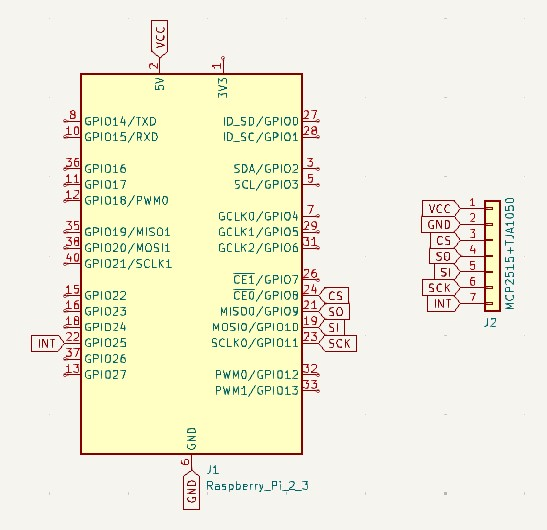
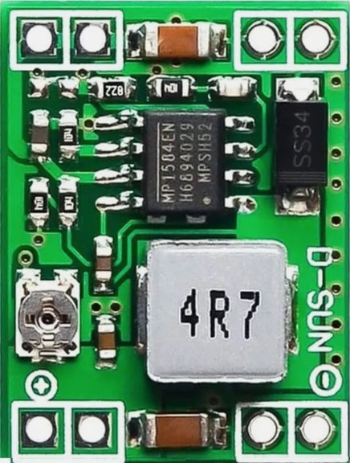
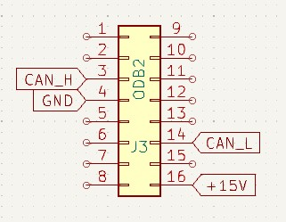

( [EN](./README.md) )
( [RU](./README-RU.md) )
---

### Simplified Diagram

Alles ist mit vorgefertigten Modulen zusammengebaut, daher ist das Diagramm stark vereinfacht.

Das Diagramm zeigt die Verbindungen zwischen dem Raspberry Pi-Anschluss und dem MCP2515+TJA1050-Modul. Das Modul wird über den RPI +5V-Pin mit Strom versorgt. Allerdings weist das Modul einen Konstruktionsfehler auf und muss modifiziert werden. Die Stromversorgung für den TJA1050 sollte bei +5V bleiben, während der MCP2515 +3V3 benötigt. Der RPi-Pinout arbeitet mit 3 Volt, toleriert 5 Volt aufgrund interner Suppressoren und benötigt keinen Pegelwandler.

Daher wurde das MCP2515+TJA1050-Modul einigen Modifikationen unterzogen. Die Leiterbahnen auf beiden Seiten wurden durchtrennt, die Kontakte gereinigt und ein AS1117-3V3-Chip aufgelötet, um die Spannung von 5 Volt auf 3 Volt zu reduzieren.

>**Warning:**
Beim Anschluss der Schaltung an den OBD2-Bordstecker darf der Jumper J1 (120Ω-Terminator) nicht vergessen werden.

Da die Module über die Bordstromversorgung des OBD2-Steckers mit Strom versorgt werden müssen, wurde der MP1854 als STEP-Down-Regler gewählt, der mit einem Eingangsspannungsbereich von 5 bis 36 Volt arbeiten kann. Zusätzlich bietet er für kurze Zeit Kurzschlussschutz.

Vor dem Anschluss des Reglers an den RPi muss die Ausgangsspannung mit dem Potentiometer auf den Bereich von 5 Volt eingestellt werden. Verbinden Sie ihn einfach mit den RPi +5V- und GND-Pins. Außerdem muss der GND-Pin mit Pin 4 des OBD2-Steckers verbunden werden, und der In+-Pin des Reglers muss mit Pin 16 des OBD2-Steckers verbunden werden.

>**Warning:**
Die Pin-Nummerierung auf dem Stecker ist im Diagramm korrekt dargestellt, aber in Wirklichkeit sind die Pins 9 bis 16 in umgekehrter Reihenfolge angeordnet, und Pin 16 befindet sich unter Pin 1.