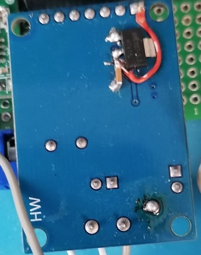

( [EN](./README.md) )
( [DE](./README-DE.md) )
---

### Упрощенная схема

Все комплектуется готовыми блоками и потому схема сильно упрощена.

На схеме представлены соединения между разъемом Raspberry Pi и модулем MCP2515+TJA1050. Питание модуля берется с контакта RPI +5V. Но конструктивно модуля содержит ошибку и требуется его изменение. Питание для TJA1050 должно остаться +5V, а для MCP2515 требуется +3V3. RPi pinout работают с уровенем 3 вольта, толерантны к 5 вольтам за счет внутренних супрессоров, и не требуют преодразователя уровней.

Поэтому модуль MCP2515+TJA1050 получил некоторые изменения. Дорожки с двух сторон были перерезаны, контакты зачищены и напаяна микросхема AS1117-3V3_ которая и понижает напряжение с 5 вольт на 3 вольта.

>**Warning:**
При соединении схемы к бортовому разъему ODB2 не нужно забывать о включении перемычки J1 (терминатор 120Ω). 

Так как питание модулей необходимо проводить c бортового питания разъема ODB2, то в качестве STEP-Down регулятора был выбран MP1854,который может работать в диапазоне входного напряжения от 5 до 36 вольт. Помимо этого предоставляет на не продолжительное время защиту от короткого замыкания.

Перед подключением регулятора к RPi необходимо выставить на нем выходное напряжение посредством потенционометра в диапазане 5 вольт. Просто соединить с контактами RPi +5V и GND. Также вывод GND должен соединяться с выводом 4 разъема ODB2, а вывод In+ регулятора с выводом 16 разъема ODB2.

>**Warning:**
схематично нумерация контактов разъема указана правильно, но в реальности контакты с 9 по 16 идут в обратном направлении и вывод 16 находится под выводом 1.

