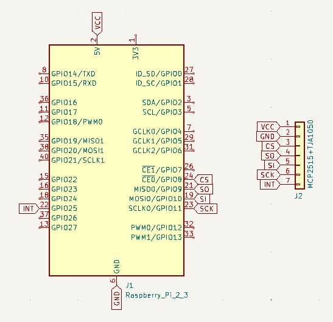
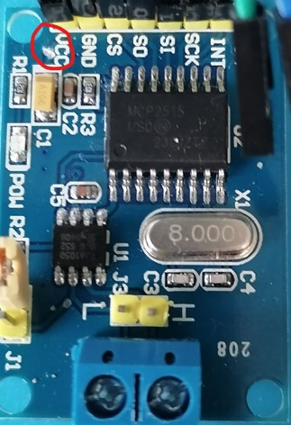
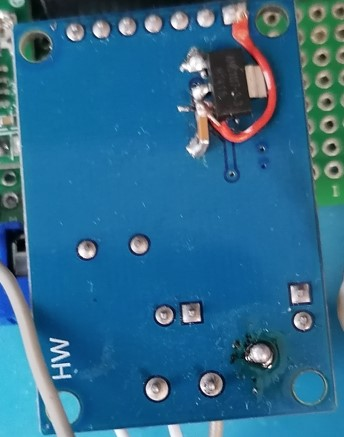
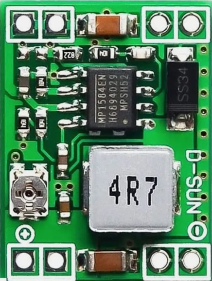
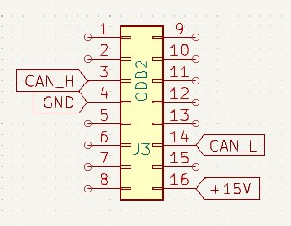

( [RU](./README-RU.md) )
( [DE](./README-DE.md) )
---

### Simplified Diagram

Everything is assembled using ready-made modules, so the diagram is greatly simplified.

The diagram shows the connections between the Raspberry Pi connector and the MCP2515+TJA1050 module. The module is powered from the RPI +5V pin. However, the module has a design flaw and requires modification. The power for the TJA1050 should remain +5V, while the MCP2515 requires +3V3. The RPi pinout operates at 3 volts, is tolerant to 5 volts due to internal suppressors, and does not require a level converter.

Therefore, the MCP2515+TJA1050 module has undergone some modifications. The traces on both sides were cut, the contacts were cleaned, and an AS1117-3V3 chip was soldered to step down the voltage from 5 volts to 3 volts.

>**Warning:**
When connecting the circuit to the OBD2 onboard connector, do not forget to include jumper J1 (120Ω terminator).

Since the modules need to be powered from the onboard power supply of the OBD2 connector, the MP1854 was chosen as the STEP-Down regulator, which can operate with an input voltage range of 5 to 36 volts. Additionally, it provides short-circuit protection for a short duration.

Before connecting the regulator to the RPi, it is necessary to set the output voltage using the potentiometer to the range of 5 volts. Simply connect it to the RPi +5V and GND pins. Also, the GND pin must be connected to pin 4 of the OBD2 connector, and the In+ pin of the regulator must be connected to pin 16 of the OBD2 connector.

>**Warning:**
The pin numbering on the connector is shown correctly in the diagram, but in reality, pins 9 to 16 are in reverse order, and pin 16 is located below pin 1.

