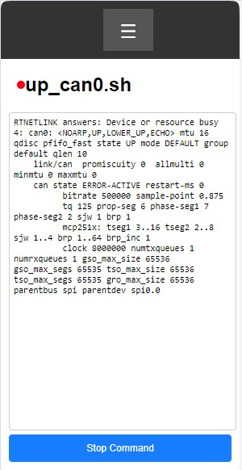
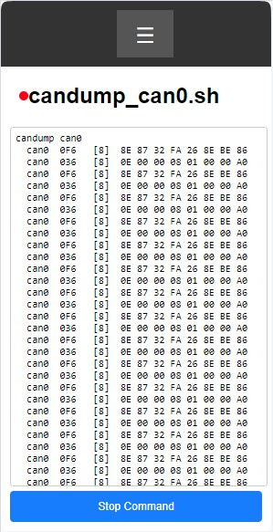
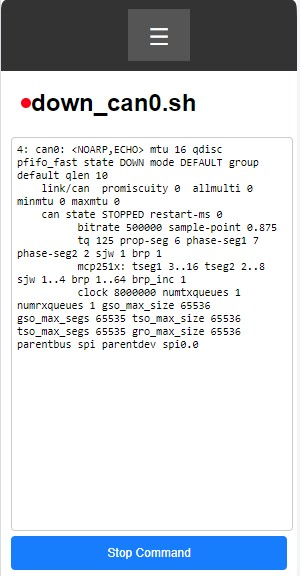

( [RU](./README-RU.md) )
( [EN](./README.md) )
---

### Image
Image basierend auf RASPBIAN OS

`Linux techtool 6.6.69-v8+ #1835 SMP PREEMPT Thu Jan  2 11:27:29 GMT 2025 aarch64 GNU/Linux`

Für die Installation auf einer SD-Karte können Sie Balena Etcher, Raspberry Pi Imager und andere verwenden.

#### Verbindungsparameter:

- **User**: technik
- **Password**: technik
- **SSH-Verbindung**: technik@techtool.local
- **WiFi-Server-IP**: 192.168.4.1

Der USB-OTG-Port des Raspberry Pi ist für die Verwendung des RNDIS-Netzwerks konfiguriert. Bei der Verbindung mit einem Linux-Computer erfolgt die Verbindung automatisch. Für Windows müssen Sie einen Treiber installieren, [wie zum Beispiel diesen](https://support.lenovo.com/ph/en/downloads/ds558735-rndis-driver-for-windows-10-lenovo-thinksystem-sr635-and-sr655).

Intern ist der SPI-0.0-Bus mit der Möglichkeit konfiguriert, die can0-Schnittstelle zu aktivieren. Dafür stehen folgende Skripte zur Verfügung:

- /usr/bin/up_can0.sh
- /usr/bin/candump_can0.sh
- /usr/bin/down_can0.sh

Zusätzlich können Sie das spi0-Gerät direkt verwenden, wenn Sie an Projekten arbeiten, zum Beispiel in Python. Vergessen Sie nicht, die can0-Netzwerkschnittstelle mit dem Befehl down_can0.sh zu deaktivieren, bevor Sie andere Programme verwenden.

### WEB-Oberfläche

csws (console simple WEB server) ist bereits als Dienst **csws.service## im System installiert. Die Datei `/etc/csws.conf` enthält eine vorkonfigurierte Einrichtung, und durch einfaches Verbinden mit http://techtool.local/ oder http://192.168.4.1/ öffnet sich die Hauptseite im Browser. Es gibt ein Menü, das vorkonfigurierte Skripte aufruft. Deren Einstellungen können in der Datei `/etc/csws.conf` angezeigt, geändert oder erweitert werden. Beispiele für HTML-Seiten befinden sich im Verzeichnis `/var/techtool/thtml`.

### Installation auf Ihrem Image

Im Verzeichnis [techtool.install](./techtool.install) befinden sich Skripte, um schnell Änderungen an den Betriebssystemdateien vorzunehmen.