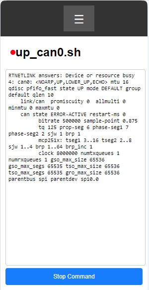
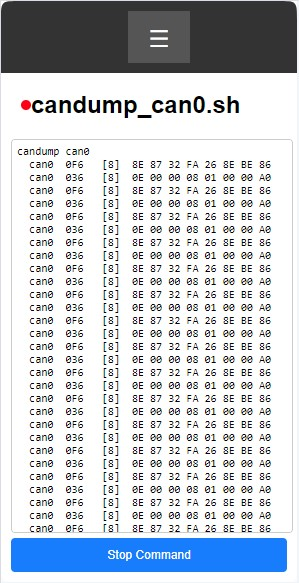

( [EN](./README.md) )
( [DE](./README-DE.md) )

### Image
Image based on RASPBIAN OS

`Linux techtool 6.6.69-v8+ #1835 SMP PREEMPT Thu Jan  2 11:27:29 GMT 2025 aarch64 GNU/Linux`

for installation on SD-Card you can use Balena Etche, Raspberry Pi Imager and etc.

#### Параметры соединения:

- **user** : technik
- **password** :technik
- **connection by ssh** : technik@techtool.local
- **WiFi-Server-IP** : 192.168.4.1

USB-OTG порт Raspberry Pi настроен на использование RNDIS Network. При подключении к компьютеру с Linux происходит автоматическое подключение. Для Windows нужно установить драйвер [например такой](https://support.lenovo.com/ph/de/downloads/ds558735-rndis-driver-for-windows-10-lenovo-thinksystem-sr635-and-sr655).

внутри настроена шина SPI-0.0 с возможностью поднять интерфейс can0. Для этого имеются следующие скрипты:

- /usr/bin/up_can0.sh
- /usr/bin/candump_can0.sh
- /usr/bin/down_can0.sh

Помимо этого можно использовать устройство spi0 напрямую при использовании проектов например на python. Не забудьте отключить сетевой интерфейс can0 командой down_can0.sh перед использованием других программ.

### WEB Interface

csws (console simple WEB server) уже установлен в сисмему в виде сервиса **csws.service##. В фале `/etc/csws.conf` имеется уже настроенная конфигурация и простым подключением http://techtool.local/ или http://192.168.4.1/ открывается основная страница браузера. На ней имеется меню, в котором вызываются предустановленные скрипты. Их настройки можно увидеть, изменить или дополнить в фале `/etc/csws.conf`. Примеры html-страниц располагаются в каталоге `/var/techtool/thtml`.

### установка на свой образ

в каталоге [techtool.istall](./techtool.install) расположены скрипты для быстрого внесения именений в файлы операционной системы.
