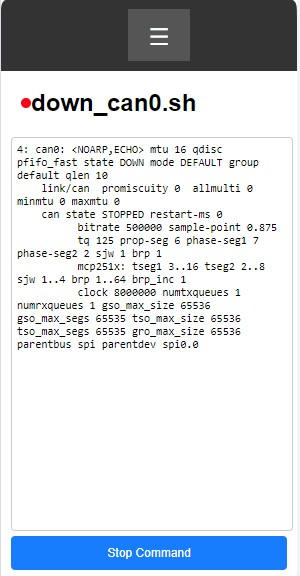

( [RU](./README-RU.md) )
( [DE](./README-DE.md) )
---

### Image
Image based on RASPBIAN OS (Debian 12)

`Linux techtool 6.6.69-v8+ #1835 SMP PREEMPT Thu Jan  2 11:27:29 GMT 2025 aarch64 GNU/Linux`

For installation on an SD card, you can use Balena Etcher, Raspberry Pi Imager, and others.

#### Connection Parameters:

- **User**: technik
- **Password**: technik
- **SSH Connection**: technik@techtool.local
- **WiFi Server IP**: 192.168.4.1

The USB-OTG port of the Raspberry Pi is configured to use the RNDIS Network. When connected to a Linux computer, it automatically connects. For Windows, you need to install a driver [such as this one](https://support.lenovo.com/ph/en/downloads/ds558735-rndis-driver-for-windows-10-lenovo-thinksystem-sr635-and-sr655).

Inside, the SPI-0.0 bus is configured with the ability to bring up the can0 interface. The following scripts are available for this:

- /usr/bin/up_can0.sh
- /usr/bin/candump_can0.sh
- /usr/bin/down_can0.sh

In addition, you can use the spi0 device directly when working with projects, for example, in Python. Do not forget to disable the can0 network interface using the down_can0.sh command before using other programs.

### WEB Interface

csws (console simple WEB server) is already installed in the system as a service **csws.service##. The file `/etc/csws.conf` contains a pre-configured setup, and by simply connecting to http://techtool.local/ or http://192.168.4.1/, the main browser page opens. It has a menu that calls pre-installed scripts. Their settings can be viewed, modified, or extended in the file `/etc/csws.conf`. Examples of HTML pages are located in the directory `/var/techtool/thtml`.

### Installation on Your Image

In the directory [techtool.install](./techtool.install), there are scripts for quickly making changes to the operating system files.